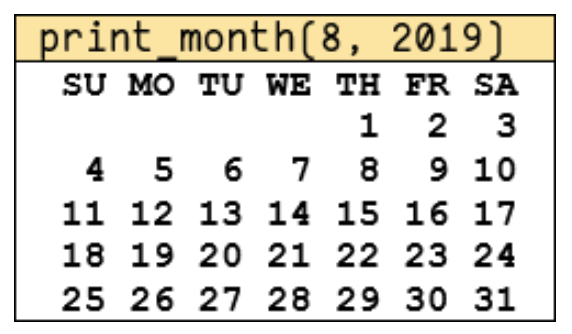

Exercise 9-2.4: Write the function ```print_month(m, y)``` 
with the inputs being the month number and year (AD) that displays the calendar of the month in year 
with the first/last days of week being Sunday and Saturday. Feel free to use the given functions ```days_in_month```, ```day_of_week```. 
Example below shows the expected output of ```print_month(8, 2019)```:


